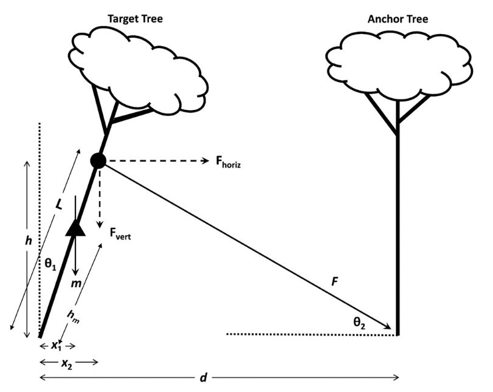
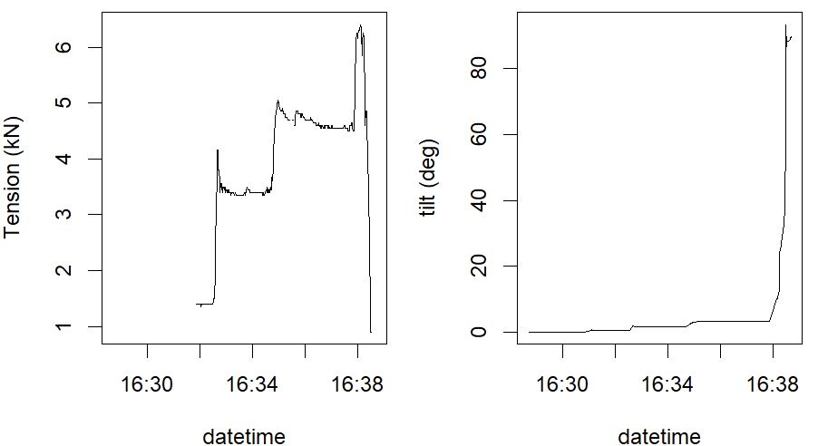
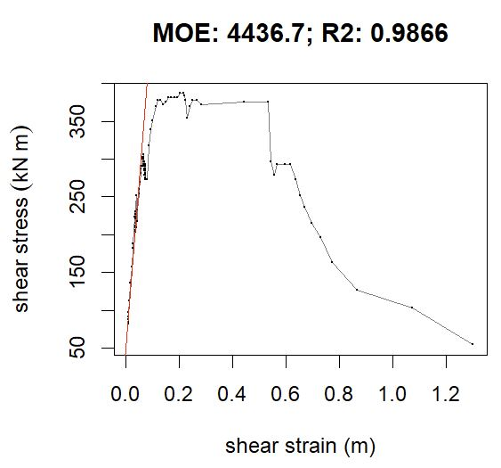
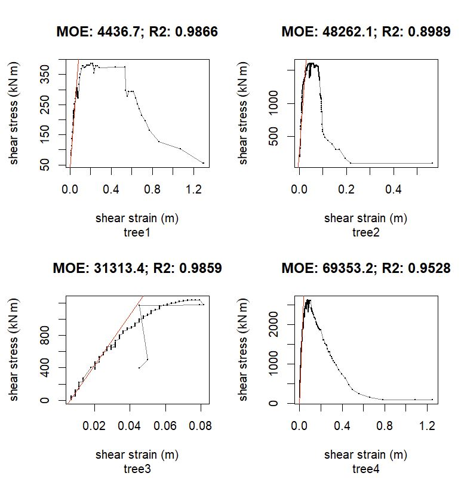

# moeR

This `R` package contains functions to generate stress-strain diagrams and
estimate modulus of elasticity (MOE) from tree winching studies, e.g.,
[Cannon et al 2015](https://www.sciencedirect.com/science/article/abs/pii/S0378112715003953) and [Cannon et al. 2024](https://www.sciencedirect.com/science/article/abs/pii/S0378112724003219)

The core functionality is to automatically

1. Combine tension data from load cell (kN) and angle measurements from
a title gauage (degrees) to generate stress-strain diagrams, and
2. Estimate modulus of elasticity automatically from the linear portion of a 
stress-strain curve.



Fig. 1. Diagram of measurements used in calculation of critical turning moment in 
tree winching study. From [Cannon et al. 2024](https://www.sciencedirect.com/science/article/abs/pii/S0378112724003219)


# Install required packages

```r
install.packages('remotes')
remotes::install_github('jbcannon/moeR')

```
Load required packages after installing
```r
library(readR)
library(moeR)
```
## Workflow

### Load and view data data

```r
# load from example data. (try tree_2, tree_3, tree_4)
tree = read_csv(system.file('extdata', 'tree_1.csv', package = 'moeR'))

# plot raw data
par(mfrow = 1:2, mar = c(4,4,1,1))
plot(F_kN ~ datetime, data = tree, type = 'l', ylab = 'Tension (kN)')
plot(tilt ~ datetime, data = tree, type = 'l', ylab = 'tilt (deg)')

```


Fig. 3. Diagram of typical data derived from tree winching experiment including
(left) measurements from tension guage and (right) measurements from title
guage. Data from [Cannon et al. 2024](https://www.sciencedirect.com/science/article/abs/pii/S0378112724003219)

## Calculate stress-strain and Modulus of Elasticity

```r
#calculate turning moment, multiply tension (F) by height of strap attachment
tree$M_kNm = tree$F_kN* tree$strap_ht_m

#calculate stress-strain diagram
ss = stress_strain(moment_kNm = tree$M_kNm,
              tilt_deg = tree$tilt,
              ht_m = 1.3,
              diam_cm = 20.2,
              plot = TRUE)

# calculate modulus of elasticity
moe = getMOE(ss$stress, ss$strain)
print(moe)
```
Output
```
       moe intercept     rmse        r2
1 4436.657  36.25342 6.340209 0.9866051
```


Fig. 3. Diagram of typical stress-strain figure. Slope of red line indicates modulus
of elasticity automatically estimated from linear portion of stress-strain curve.
Data from [Cannon et al. 2024](https://www.sciencedirect.com/science/article/abs/pii/S0378112724003219)

## Write loop to repeat for several trees
```r
tree1 = read_csv(system.file('extdata', 'tree_1.csv', package = 'moeR'))
tree2 = read_csv(system.file('extdata', 'tree_2.csv', package = 'moeR'))
tree3 = read_csv(system.file('extdata', 'tree_3.csv', package = 'moeR'))
tree4 = read_csv(system.file('extdata', 'tree_4.csv', package = 'moeR'))

treelist = c('tree1', 'tree2', 'tree3', 'tree4')
par(mfrow = c(2,2), oma=c(1,1,1,1))
for(t in treelist) {
  tree = get(t)  
  #calculate turning moment
  tree$M_kNm = tree$F_kN* tree$strap_ht_m
  #calculate stress-strain diagram
  ss = stress_strain(moment_kNm = tree$M_kNm,
                     tilt_deg = tree$tilt,
                     ht_m = 1.3,
                     diam_cm = tree$diam_cm[1],  #grab first tree diam measuremnt
                     plot=FALSE)
  # calculate modulus of elasticity
  moe = getMOE(ss$stress, ss$strain, plot=TRUE)
  cat('---', t, '---\n')
  print(moe)
  title(sub = t)
}
```
Output:

```
--- tree1 ---
       moe intercept     rmse        r2
1 4436.657  36.25342 6.340209 0.9866051
--- tree2 ---
       moe intercept     rmse        r2
1 48262.12  292.5438 136.0751 0.8988749
--- tree3 ---
       moe intercept     rmse        r2
1 31313.44 -193.1908 21.15497 0.9858685
--- tree4 ---
       moe intercept     rmse        r2
1 69353.22  128.3207 82.18812 0.9528323
```



Fig. 4. Stress-strain curves for four *Pinus elliottii*. Slope of red line
indicates modulus of elasticity automatically estimated from linear portion
of stress-strain curve. Data from [Cannon et al. 2024](https://www.sciencedirect.com/science/article/abs/pii/S0378112724003219)
